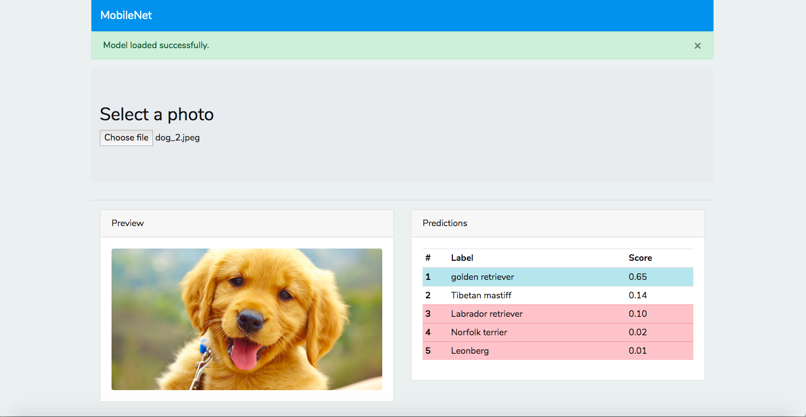

[overview.md] https://github.com/shawpan/image-classifier-app/blob/master/overview.md describes the solution.

**A simple web app for deep learning image classification.**

_Example of an image classifier web app [(source)](https://medium.com/agara-labs/image-classification-with-the-client-side-neural-network-using-tensorflow-js-8f94d3dc7c5c)._
